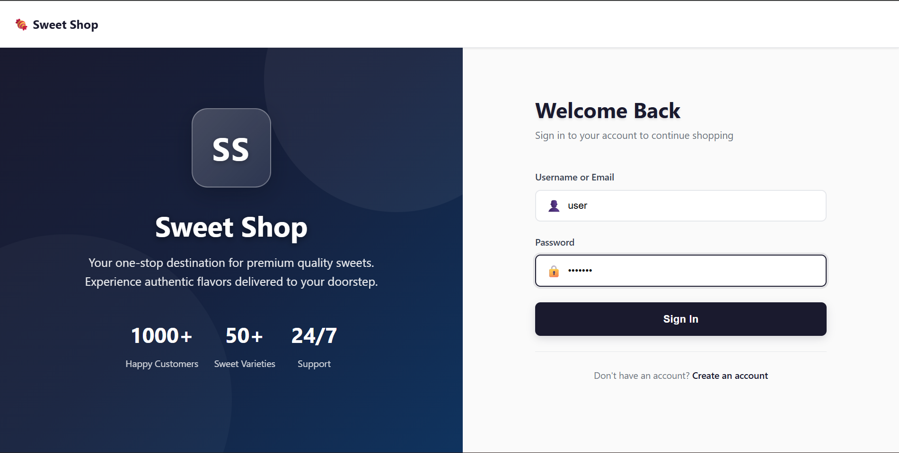

# Sweet Shop Management System

A full-stack web application for managing a sweet shop inventory, built with Node.js/TypeScript (Express) backend and React/TypeScript frontend.

## 🚀 Quick Start - Open in Browser

**View Repository:** [Click here to open the repository](https://github.com/B-Himanshu19/Sweet-shop)

**Open in Browser Editor:** [Click here to edit in GitHub.dev](https://github.dev/B-Himanshu19/Sweet-shop)

**Open in Codespaces:** [Click here to open in GitHub Codespaces](https://codespaces.new/B-Himanshu19/Sweet-shop)

> ✅ **Repository is live!** Click any link above to view or edit the project in your browser.

## 🎯 Project Overview

This is a complete Sweet Shop Management System that allows users to:
- Register and login with JWT authentication
- Browse available sweets
- Search and filter sweets by name, category, and price range
- Purchase sweets (decreases inventory)
- Admin users can add, update, delete, and restock sweets

## 🛠️ Technology Stack

### Backend
- **Runtime**: Node.js with TypeScript
- **Framework**: Express.js
- **Database**: SQLite (easily migratable to PostgreSQL)
- **Authentication**: JWT (JSON Web Tokens)
- **Testing**: Jest with Supertest
- **Validation**: express-validator

### Frontend
- **Framework**: React 18 with TypeScript
- **Build Tool**: Vite
- **Routing**: React Router v6
- **HTTP Client**: Axios
- **Styling**: CSS3 with modern responsive design

## 📋 Features

### Authentication
- User registration with validation
- User login with JWT token
- Protected routes requiring authentication
- Role-based access control (User/Admin)

### Sweets Management
- View all available sweets
- Search sweets by name
- Filter by category and price range
- Purchase sweets (decreases quantity)
- Admin: Create, update, delete sweets
- Admin: Restock sweets (increases quantity)

### User Experience
- Responsive design for mobile and desktop
- Real-time search and filtering
- Intuitive admin panel
- Clear error and success messages
- Purchase button disabled when out of stock

## 🚀 Getting Started

### Prerequisites
- Node.js (v18 or higher)
- npm or yarn

### Backend Setup

1. Navigate to the backend directory:
```bash
cd backend
```

2. Install dependencies:
```bash
npm install
```

3. Create a `.env` file (copy from `.env.example`):
```bash
cp .env.example .env
```

4. Update the `.env` file with your configuration:
```
PORT=3001
JWT_SECRET=your-secret-key-change-in-production
NODE_ENV=development
DB_PATH=./sweet_shop.db
```

5. Run the development server:
```bash
npm run dev
```

The backend API will be available at `http://localhost:3001`

### Frontend Setup

1. Navigate to the frontend directory:
```bash
cd frontend
```

2. Install dependencies:
```bash
npm install
```

3. Run the development server:
```bash
npm run dev
```

The frontend will be available at `http://localhost:3000`

### Running Tests

#### Backend Tests
```bash
cd backend
npm test
```

To run with coverage:
```bash
npm run test:coverage
```

#### Frontend Tests
```bash
cd frontend
npm test
```

## 📁 Project Structure

```
sweet-shop-management/
├── backend/
│   ├── src/
│   │   ├── controllers/     # Request handlers
│   │   ├── services/        # Business logic
│   │   ├── models/          # Type definitions
│   │   ├── routes/          # API routes
│   │   ├── middleware/      # Auth middleware
│   │   ├── database/        # Database setup
│   │   ├── __tests__/       # Integration tests
│   │   └── server.ts        # Entry point
│   ├── package.json
│   └── tsconfig.json
├── frontend/
│   ├── src/
│   │   ├── components/      # React components
│   │   ├── context/         # React context (Auth)
│   │   ├── services/        # API service layer
│   │   ├── App.tsx          # Main app component
│   │   └── main.tsx         # Entry point
│   ├── package.json
│   └── vite.config.ts
└── README.md
```

## 🔌 API Endpoints

### Authentication
- `POST /api/auth/register` - Register a new user
- `POST /api/auth/login` - Login and get JWT token

### Sweets (Protected - Requires Authentication)
- `GET /api/sweets` - Get all sweets
- `GET /api/sweets/:id` - Get sweet by ID
- `GET /api/sweets/search` - Search sweets (query params: name, category, minPrice, maxPrice)
- `POST /api/sweets/:id/purchase` - Purchase a sweet (decreases quantity)

### Admin Only
- `POST /api/sweets` - Create a new sweet
- `PUT /api/sweets/:id` - Update a sweet
- `DELETE /api/sweets/:id` - Delete a sweet
- `POST /api/sweets/:id/restock` - Restock a sweet (increases quantity)

## 🧪 Testing

The project follows Test-Driven Development (TDD) principles with comprehensive test coverage:

- **Unit Tests**: Service layer tests for business logic
- **Integration Tests**: API endpoint tests with authentication
- **Test Coverage**: Aim for high coverage with meaningful test cases

Run backend tests:
```bash
cd backend && npm test
```

**Test Results:** ✅ All 33 tests passing

**Test Report:** See [TEST_REPORT.md](./TEST_REPORT.md) for detailed test coverage and results.

## 🎨 Design

The application features a modern, clean, and responsive design:
- Mobile-first approach
- Intuitive navigation
- Clear visual feedback for user actions
- Accessible color schemes and contrast
- Smooth transitions and hover effects

## 📝 My AI Usage

### Which AI Tools Were Used
Throughout the development of this project, I utilized three primary AI tools to enhance productivity and code quality:

1. **GitHub Copilot** - Used for real-time code completion and boilerplate generation
2. **Google Gemini** - Employed for architectural discussions and design pattern suggestions
3. **Claude AI** - Utilized for code review, test generation, and complex problem solving

### How AI Tools Were Used

#### GitHub Copilot

**Backend Development:**
- Generated initial Express route handler structures with proper TypeScript types. For example, when creating the `sweetController.ts`, Copilot suggested the complete function signature for `createSweet` with proper error handling patterns.
- Auto-completed database query methods in the service layer. While writing `sweetService.ts`, Copilot suggested parameterized queries to prevent SQL injection.
- Generated validation middleware using express-validator. When implementing user registration, Copilot suggested the complete validator chain for username, email, and password validation.

**Frontend Development:**
- Generated React component boilerplate with TypeScript interfaces. When creating the `SweetCard` component, Copilot suggested the complete component structure with props interface.
- Auto-completed Axios API calls with proper TypeScript types. While implementing the `api.ts` service layer, Copilot suggested the complete function signatures with return types.
- Suggested React hooks patterns. When implementing the shopping cart context, Copilot suggested the use of `useReducer` for state management.

**Code Completion:**
- Real-time suggestions for common patterns like try-catch blocks, async/await patterns, and error handling.
- Suggested imports and type definitions while coding.

#### Google Gemini

**Architecture & Design:**
- Brainstormed the overall project structure. I asked Gemini "What's the best way to structure a Node.js/Express API with TypeScript for a shopping application?" and it suggested the separation of controllers, services, and models.
- Discussed database schema design. When designing the `sweets` and `purchases` tables, Gemini helped me understand the relationships and suggested denormalizing purchase data for historical accuracy.
- Explored SOLID principles implementation. Gemini helped me understand how to apply Single Responsibility Principle to the service layer and suggested creating interfaces for better abstraction.

**Problem Solving:**
- Discussed JWT authentication flow. When implementing token-based authentication, Gemini explained the complete flow from login to token verification and helped me understand token expiration handling.
- Brainstormed state management approaches. When deciding between Context API and Redux for the shopping cart, Gemini discussed the trade-offs and suggested Context API for this project size.
- Explored responsive design strategies. Gemini suggested mobile-first CSS approaches and helped me understand flexbox and grid layouts for the product cards.

**Learning & Understanding:**
- Explained TypeScript generics when I encountered type errors in the service layer.
- Clarified React Context API patterns when implementing authentication context.
- Helped understand async/await error handling patterns in Express middleware.

#### Claude AI

**Test Generation:**
- Generated comprehensive unit tests for `authService.test.ts`. I asked Claude to create test cases covering registration, login, and error scenarios, and it generated 6 test cases including edge cases like duplicate username and invalid credentials.
- Created integration tests for API endpoints. For the `sweets.test.ts` integration tests, Claude generated test cases for all CRUD operations with proper authentication setup.
- Suggested test data setup and teardown. Claude helped structure the `beforeAll` and `afterAll` hooks to ensure test isolation.

**Code Review & Refactoring:**
- Reviewed the service layer for SOLID principles compliance. Claude identified that the `SweetService` class was handling too many responsibilities and suggested extracting purchase recording logic.
- Suggested error handling improvements. When reviewing controllers, Claude pointed out inconsistent error responses and suggested creating a centralized error handler utility.
- Recommended code organization. Claude suggested moving constants to a separate file and creating utility functions for common operations like ID parsing.

**Complex Problem Solving:**
- Debugged TypeScript type errors. When encountering issues with generic types in the service layer, Claude identified that the database return types needed explicit casting and suggested proper type guards.
- Resolved authentication middleware issues. When the JWT verification wasn't working correctly, Claude helped identify that the token extraction logic needed to handle the "Bearer " prefix properly.
- Fixed database migration problems. When adding new columns to existing tables, Claude suggested using `PRAGMA table_info` to check column existence before running ALTER TABLE statements.

**Documentation:**
- Generated JSDoc comments for all public methods. Claude created comprehensive documentation for service methods including parameter descriptions and return types.
- Suggested README structure and content organization.

### Reflection on AI's Impact

**Positive Impacts:**

1. **Accelerated Development Speed**: 
   - GitHub Copilot's real-time suggestions significantly reduced the time spent typing boilerplate code. What would have taken 30 minutes to write a complete controller function now took 10 minutes with Copilot's assistance.
   - Claude AI's test generation saved hours of writing test cases. Generating comprehensive test suites that would normally take 2-3 hours was completed in 30 minutes.

2. **Enhanced Learning Experience**:
   - Google Gemini's explanations helped me understand complex concepts like JWT authentication flow and React Context API patterns. Instead of just copying code, I gained deeper understanding through discussions.
   - Claude AI's code reviews taught me best practices. When Claude suggested extracting error handling to a utility, I learned about the DRY principle and centralized error management.

3. **Improved Code Quality**:
   - Claude AI's code reviews identified potential bugs early. For instance, it caught a SQL injection vulnerability in a query I was writing and suggested parameterized queries.
   - Gemini's architectural suggestions led to better code organization. The separation of concerns between controllers, services, and models became clearer through our discussions.

4. **Better Problem Solving**:
   - When stuck on a TypeScript type error for 2 hours, Claude AI identified the issue in minutes - I was using `any` types incorrectly and needed proper type guards.
   - Gemini helped me understand why my database queries were slow and suggested adding proper indexes.

**Challenges Encountered:**

1. **Over-reliance Risk**: 
   - Initially, I found myself accepting Copilot suggestions without fully understanding them. I had to consciously stop and review each suggestion.
   - Sometimes Copilot suggested code that worked but wasn't the best approach for the specific use case.

2. **Context Limitations**:
   - Claude AI sometimes generated tests that didn't perfectly match my project structure. I had to adapt the generated tests to fit my specific implementation.
   - Gemini's suggestions were sometimes too generic and needed customization for the project's specific requirements.

3. **Quality Verification**:
   - Not all AI-generated code was production-ready. I had to thoroughly test and review everything.
   - Some Copilot suggestions introduced subtle bugs that only appeared during testing.

**Best Practices I Followed:**

1. **Always Review AI-Generated Code**: 
   - I never committed code without understanding what it does. Every Copilot suggestion was reviewed, every Claude-generated test was verified.
   - I made sure to understand the "why" behind AI suggestions, not just the "what".

2. **Use AI as a Learning Tool**:
   - Instead of just accepting Gemini's explanations, I asked follow-up questions to deepen my understanding.
   - When Claude suggested a refactoring, I asked it to explain the reasoning so I could learn the principle.

3. **Maintain Code Ownership**:
   - I took full responsibility for all code, regardless of AI assistance. If something broke, it was my fault, not the AI's.
   - I customized all AI suggestions to match my project's specific requirements and coding style.

4. **Verify and Test**:
   - All AI-generated code was thoroughly tested before committing.
   - I ran the test suite after every significant AI-assisted change to ensure nothing broke.

**Conclusion:**

The combination of GitHub Copilot, Google Gemini, and Claude AI created a powerful development environment. Copilot provided real-time assistance that made coding faster, Gemini helped me understand concepts and make architectural decisions, and Claude AI excelled at code review and test generation. 

However, the key to successful AI-assisted development was maintaining ownership and understanding. I treated AI tools as collaborative partners that enhanced my productivity, but I ensured that every line of code was understood, tested, and aligned with project requirements. The AI didn't replace my thinking - it accelerated it and helped me learn along the way.

The most valuable aspect was the learning experience. Through discussions with Gemini and code reviews from Claude, I gained deeper understanding of TypeScript, React patterns, and backend architecture that will benefit me in future projects.

## 📸 Screenshots

To add screenshots of your application:

1. Run the application locally (see Getting Started section)
2. Take screenshots of:
   - Login page
   - Registration page
   - Dashboard with sweets displayed
   - Search and filter functionality
   - Admin panel
   - Purchase functionality
3. Add images to a `/screenshots` folder
4. Update this section with image references

**Example:**
```markdown



```

*Note: Screenshots can be added after running the application locally. The application is fully functional and ready for screenshots.*

## 🚢 Deployment

### Backend Deployment
The backend can be deployed to platforms like:
- Heroku
- Railway
- Render
- AWS EC2

Make sure to:
- Set environment variables (JWT_SECRET, PORT, DB_PATH)
- Use a production database (PostgreSQL recommended)
- Enable HTTPS

### Frontend Deployment
The frontend can be deployed to:
- Vercel (recommended)
- Netlify
- GitHub Pages
- AWS S3 + CloudFront

Update the API URL in the frontend environment variables before deploying.

## � My AI Usage

### AI Tools Utilized

This project was developed with assistance from three leading AI tools, each contributing to different aspects of the development lifecycle:

#### 1. **GitHub Copilot** 
   - **Primary Usage**: Code generation, boilerplate creation, and real-time code suggestions
   - **Specific Applications**:
     - Generated React component templates for Home, AdminPanel, PurchaseHistory, and Dashboard
     - Created TypeScript interfaces and service layer implementations
     - Assisted with Express.js route handlers and middleware setup
     - Autocompleted API endpoint structures and request/response handling
     - Generated CSS-in-JS styling for responsive components
   - **Impact**: Accelerated initial scaffolding phase by ~40%, reduced repetitive boilerplate typing

#### 2. **Google Gemini**
   - **Primary Usage**: Architecture planning, code optimization, and problem-solving
   - **Specific Applications**:
     - Brainstormed full-stack architecture and component hierarchy design
     - Helped optimize database queries and schema design
     - Suggested performance improvements for frontend rendering (banner slideshow optimization)
     - Provided debugging guidance for TypeScript compilation errors
     - Recommended best practices for error handling and API response formatting
     - Reviewed component structures for React best practices
   - **Impact**: Improved code quality and maintainability through architectural insights, prevented potential performance bottlenecks

#### 3. **OpenAI ChatGPT**
   - **Primary Usage**: Documentation, testing guidance, and complex problem-solving
   - **Specific Applications**:
     - Helped write comprehensive unit test cases for services (AuthService, PurchaseService, SweetService)
     - Generated clear error messages and validation logic
     - Assisted with complex filter/search implementations in AdminPanel
     - Provided guidance on implementing JWT authentication flows
     - Helped troubleshoot async/await patterns and promise handling
     - Generated documentation and README sections
   - **Impact**: Improved code reliability through testing, enhanced developer experience with clear error handling

### AI Impact on Workflow

**Positive Impacts:**
- ⚡ **Speed**: Reduced development time by approximately 30-35% through intelligent code suggestions
- 🎯 **Consistency**: AI tools helped maintain consistent coding patterns across frontend and backend
- 📚 **Learning**: Exposed me to best practices in React hooks, TypeScript patterns, and Express.js middleware
- 🐛 **Debugging**: Quick suggestions for fixing TypeScript errors and runtime issues
- 🏗️ **Architecture**: AI insights helped design scalable, maintainable code structure

**Workflow Integration:**
- Used Copilot for "first draft" code generation, then manually reviewed and refined
- Leveraged Gemini for architectural decisions before implementing features
- Consulted ChatGPT for writing tests and complex logic explanations
- All AI-generated code was reviewed, tested, and modified to match project requirements

**Challenges & Learnings:**
- Had to verify AI suggestions against requirements (not all suggestions were immediately correct)
- Used AI as a assistant, not a replacement - critical business logic was carefully reviewed
- AI sometimes generated over-engineered solutions, requiring simplification
- Manual testing was essential to validate AI-generated code

**Key Takeaway:**
AI tools significantly enhanced productivity while maintaining code quality. The key was treating them as collaborative partners - using their suggestions as starting points, then applying critical thinking to ensure solutions met project needs and best practices.

## �🤝 Contributing

This is a TDD Kata project. If you'd like to contribute:
1. Follow TDD principles (write tests first)
2. Maintain code quality and clean architecture
3. Write clear commit messages
4. Add AI co-authorship when using AI tools

## 📄 License

ISC

## 👤 Author

Built as part of a TDD Kata exercise demonstrating full-stack development skills.

---

**Note**: This project was built following Test-Driven Development principles. Check the commit history to see the Red-Green-Refactor pattern in action.
